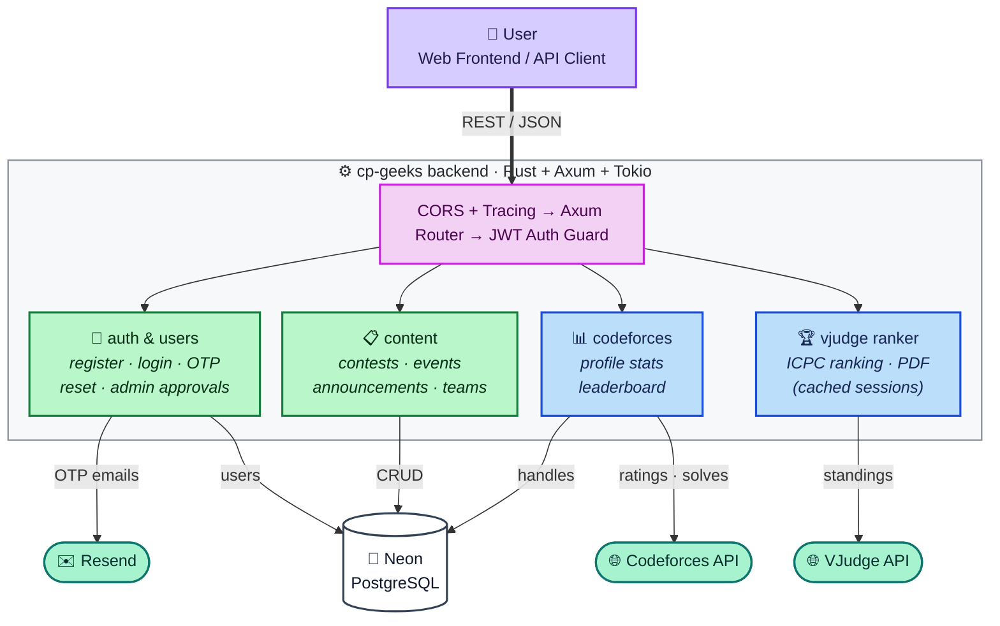

# SUST CP Geeks Backend

REST API powering the SUST Competitive Programming Community Platform — built with Rust, Axum, and PostgreSQL.


## Architecture



## Tech Stack

| Layer | Technology |
|-------|-----------|
| Runtime / Framework | Tokio · Axum 0.8 |
| Database | PostgreSQL (Neon) via SQLx |
| Auth | JWT · Argon2id |
| Email | Resend (OTP + password reset) |
| External APIs | Codeforces · VJudge |

## Getting Started

```bash
git clone git@github.com:sust-cp-geeks/cp-geeks-backend.git
cd cp-geeks-backend

cp .env.example .env   # fill in the variables below
cargo run              # serves at http://localhost:8080
```

| Variable | Required | Description |
|----------|----------|-------------|
| `DATABASE_URL` | Yes | Neon PostgreSQL connection string |
| `JWT_SECRET` | Yes | Secret key for signing JWT tokens |
| `RESEND_API_KEY` | Yes | Resend API key for OTP emails |
| `RESEND_FROM_EMAIL` | No | Sender address (defaults to `onboarding@resend.dev`) |

## API

| Group | Endpoints | Access |
|-------|-----------|--------|
| Auth | `register`, `verify-otp`, `resend-otp`, `login`, `forgot-password`, `reset-password` | Public |
| Profile | `get_me`, `update_me` | User |
| Codeforces | `profile/{id}`, `leaderboard` | User |
| VJudge Ranker | `analyze`, `pdf/{session_id}` | Public |
| Contests | CRUD (5 endpoints) | User / Admin |
| Announcements | CRUD (5 endpoints) | User / Admin |
| Events + Teams | CRUD (8 endpoints) | User / Admin / Manager |
| Admin | User management (5 endpoints) | Admin |
| Health | Server status | Public |

Full request/response reference: [`docs/api.md`](docs/api.md)

## Project Structure

```
src/
├── main.rs          # entry point, router assembly, CORS
├── app_state.rs     # shared state (db pool + results cache)
├── config/          # database connection pool
├── models/          # request/response + domain types
├── handlers/        # HTTP handlers per resource
├── services/        # business logic, external API clients
├── middleware/      # JWT claims extractor
├── routes/          # route definitions per resource
└── utils/           # JWT + OTP helpers
```

## Security

- Argon2id password hashing · JWT (HMAC-SHA256, 7-day expiry)
- Email OTP verification — 6-digit, 10-minute expiry, single-use
- Parameterized SQL queries, user-enumeration prevention, no hash exposure in responses

## License

MIT — built by [SUST CP Geeks](https://github.com/sust-cp-geeks)
