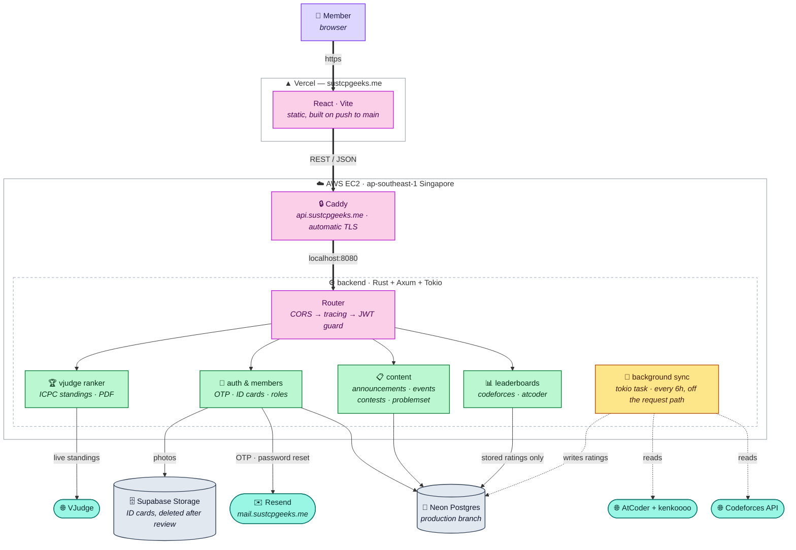

# SUST CP Geeks Backend

REST API powering the SUST Competitive Programming Community Platform — built with Rust, Axum, and PostgreSQL.


## Architecture



**Solid arrows are the request path; dashed arrows are the background sync.** The
distinction is the point: a member's page load never waits on Codeforces or
AtCoder. A worker refreshes ratings every six hours and the leaderboards read
what it stored, so an outage at either judge costs freshness rather than
availability — which was not a hypothetical, both went down while this was being
built. The VJudge ranker is the exception and still calls out live, because it
ranks whichever contests you paste in at that moment.

## Tech Stack

| Layer | Technology |
|-------|-----------|
| Runtime / Framework | Tokio · Axum 0.8 |
| Database | PostgreSQL (Neon) via SQLx |
| Auth | JWT · Argon2id · rate-limited OTP |
| File storage | Supabase Storage (private bucket, signed URLs) |
| Email | Resend (OTP + password reset) |
| External APIs | Codeforces · VJudge · AtCoder |

## Getting Started

Needs a Rust toolchain plus **`cmake` and a C compiler** — TLS is handled by
rustls, whose crypto backend compiles from C. Without them the build fails
while compiling `aws-lc-sys`, with an error that does not obviously point at
TLS. On Debian or Ubuntu:

```bash
sudo apt install build-essential cmake
```

```bash
git clone git@github.com:sust-cp-geeks/cp-geeks-backend.git
cd cp-geeks-backend

cp .env.example .env   # fill in the variables below
cargo run              # serves at http://localhost:8080
```

The compiler version is pinned in `rust-toolchain.toml`, so the first `cargo`
command may spend a minute fetching that exact toolchain. That is deliberate: CI
lints with `-D warnings`, and when CI and a laptop ran different compilers a new
lint in a newer Rust could fail the build on code nobody had touched. Pinning
means `cargo clippy` here checks the same rules CI does.

The release binary links no OpenSSL and needs only libc, so it runs on any
Linux regardless of what the build machine had installed. The host does still
need a CA bundle (`ca-certificates`) for outbound mail — present on every normal
distribution image, absent from minimal container bases such as `scratch` and
`distroless`.

Apply the schema to a fresh database in order — the files are idempotent, so
re-running them is safe:

```bash
for f in migrations/*.sql; do psql "$DATABASE_URL" -f "$f"; done
```

| Variable | Required | Description |
|----------|----------|-------------|
| `DATABASE_URL` | Yes | Neon PostgreSQL connection string |
| `JWT_SECRET` | Yes | Secret key for signing JWT tokens |
| `RESEND_API_KEY` | Yes | Resend API key for OTP emails |
| `SUPABASE_URL` | For ID cards | Supabase project URL |
| `SUPABASE_SECRET_KEY` | For ID cards | Secret key — not the publishable one |
| `SUPABASE_BUCKET` | For ID cards | Private bucket for ID card photos |
| `RESEND_FROM_EMAIL` | No | Sender address (defaults to `onboarding@resend.dev`) |
| `CORS_ALLOWED_ORIGINS` | No | Comma-separated allowed origins (defaults to localhost `:5173`, `:4173`, `:3000`) |
| `PORT` | No | Listen port (defaults to `8080`) |
| `RUST_LOG` | No | Log filter (defaults to `info,tower_http=debug`) |

## API

| Group | Endpoints | Access |
|-------|-----------|--------|
| Auth | `register`, `verify-otp`, `resend-otp`, `login`, `forgot-password`, `reset-password`, `status`, `change-email` ×2 | Public |
| Profile | `me` (get/update), `{id}`, `search` | User |
| Codeforces | `profile/{id}`, `leaderboard` | User |
| AtCoder | `profile/{id}`, `leaderboard` (background-synced) | User |
| Contests | CRUD (5) | User / Admin |
| Announcements | CRUD + `categories` (6) | User / Admin · Manager |
| Events + Teams | CRUD (8) | Public read / Admin · Manager |
| Problemset | `GET /` + 3 create endpoints | Public read / Admin write |
| Admin | User management, roles, ID card review, recovery (10) | Admin |
| VJudge Ranker | `analyze`, `pdf/{session_id}`, `contest-title/{id}` | Public |
| Health | Server status | Public |

Full request/response reference: [`docs/api.md`](docs/api.md)

## Project Structure

```
src/
├── main.rs          # entry point, router, CORS, graceful shutdown
├── app_state.rs     # shared state (db pool, ranker cache, rate limiter)
├── errors.rs        # AppError → HTTP response, role guards
├── validation.rs    # shared input + datetime validation
├── config/          # database connection pool
├── models/          # request/response + domain types
├── handlers/        # HTTP handlers per resource
├── services/        # external clients (codeforces, vjudge, email,
│                    #   storage, image processing) + ranker logic
├── middleware/      # JWT extractor + session-validity check
├── routes/          # route definitions per resource
└── utils/           # JWT, OTP, rate limiting

migrations/          # schema, applied in filename order
docs/api.md          # full request/response reference
fonts/               # bundled TTFs for ranker PDF export
deploy/              # systemd units, Caddyfile, deploy + backup scripts
rust-toolchain.toml  # pinned compiler, shared by CI and every laptop
```

## Security

- **Passwords** — Argon2id hashing, never returned in any response
- **Tokens** — JWT (HMAC-SHA256, 7-day expiry). A password reset, ban, or admin
  email change invalidates every token issued before it
- **OTP** — 6-digit, 10-minute expiry, single-use, and burned after 5 wrong guesses
- **Rate limits** — per-email on OTP attempts, logins and outbound mail; per-IP on the ranker
- **ID cards** — private bucket, 5-minute signed URLs, EXIF stripped on upload,
  deleted as soon as an admin decides
- **Queries** — parameterized throughout; database errors are logged, never echoed to clients

## License

MIT — built by [SUST CP Geeks](https://github.com/sust-cp-geeks)
