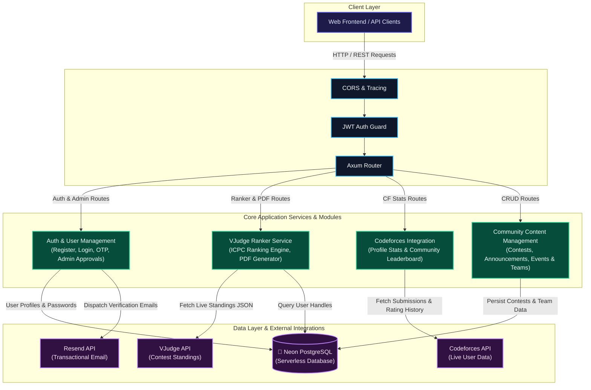

<div align="center">

# SUST CP Geeks Backend

**High-performance REST API powering the SUST Competitive Programming Community Platform**

[](https://www.rust-lang.org/)
[](https://github.com/tokio-rs/axum)
[](https://neon.tech/)
[](https://jwt.io/)

</div>

---

## Tech Stack

| Layer | Technology | Purpose |
|-------|-----------|---------|
| Runtime | Tokio | Async runtime with work-stealing scheduler |
| Framework | Axum 0.8 | Ergonomic, type-safe HTTP framework |
| Database | PostgreSQL (Neon) | Serverless Postgres with connection pooling |
| ORM | SQLx | Compile-time checked SQL queries |
| Auth | JWT + Argon2id | Stateless authentication with memory-hard hashing |
| Email | Resend | Transactional email for OTP verification + password reset |
| External API | Codeforces | Live rating, solve stats, contest history |
| External API | VJudge | Contest standings for ICPC-style ranking |

## Quick Start

### Prerequisites

- [Rust](https://rustup.rs/) (latest stable)
- [PostgreSQL](https://neon.tech/) database (Neon recommended)
- [Resend](https://resend.com/) API key (for email OTP)

### Setup

```bash
git clone git@github.com:sust-cp-geeks/cp-geeks-backend.git
cd cp-geeks-backend

cp .env.example .env
# edit .env — see Environment Variables below

cargo run
```

The server starts at **`http://localhost:8080`**

## Environment Variables

| Variable | Required | Description |
|----------|----------|-------------|
| `DATABASE_URL` | Yes | Neon PostgreSQL connection string |
| `JWT_SECRET` | Yes | Secret key for signing JWT tokens |
| `RESEND_API_KEY` | Yes | Resend API key for OTP emails |
| `RESEND_FROM_EMAIL` | No | Sender address (defaults to `onboarding@resend.dev`) |

## API Endpoints Overview

| Group | Endpoints | Access |
|-------|-----------|--------|
| Auth | `register`, `verify-otp`, `resend-otp`, `login`, `forgot-password`, `reset-password` | Public |
| Profile | `get_me`, `update_me` | User |
| Codeforces | `profile/{id}`, `leaderboard` | User |
| VJudge Ranker | `analyze`, `pdf/{session_id}` | Public |
| Contests | CRUD (5 endpoints) | User / Admin |
| Announcements | CRUD (5 endpoints) | User / Admin |
| Events + Teams | CRUD (8 endpoints) | User / Admin / Manager |
| Admin | User management (5 endpoints) | Admin |
| Health | Server status | Public |

> **Full API Reference with request/response shapes:** [`docs/api.md`](docs/api.md)

## Architecture



### Request Lifecycle

```
Client Request
     │
     ▼
┌─────────────┐
│  CORS Layer  │  ← allows frontend origins
└──────┬──────┘
       ▼
┌─────────────┐
│ Axum Router  │  ← matches route → handler
└──────┬──────┘
       ▼
┌─────────────┐
│JWT Middleware│  ← extracts Claims from Bearer token (protected routes only)
└──────┬──────┘
       ▼
┌─────────────┐
│   Handler    │  ← validates input, orchestrates logic
└──────┬──────┘
       ▼
┌─────────────┐
│   Service    │  ← business logic, external API calls
└──────┬──────┘
       ▼
┌─────────────┐
│  Database /  │  ← SQLx queries (Neon PostgreSQL)
│ External API │  ← reqwest HTTP calls (Codeforces, VJudge, Resend)
└─────────────┘
```

## Project Structure

```
src/
├── main.rs                      # entry point, router assembly, cors
├── app_state.rs                 # shared application state (db pool + results cache)
├── errors.rs                    # unified AppError enum + IntoResponse
├── validation.rs                # input validation helpers
├── config/
│   └── database.rs              # neon postgres connection pool
├── models/
│   ├── user.rs                  # User, RegisterInput, LoginInput
│   ├── contest.rs               # Contest, CreateContest, UpdateContest
│   ├── announcement.rs          # Announcement, CreateAnnouncement
│   ├── event.rs                 # Event, Team, TeamMember
│   ├── codeforces.rs            # CF API types, ProfileStats, Leaderboard
│   └── ranker.rs                # VJudge contest types, RankerRequest/Response
├── handlers/
│   ├── auth_handler.rs          # register, login, OTP, password reset
│   ├── user_handler.rs          # profile management
│   ├── admin_handler.rs         # user approval, rejection, banning
│   ├── contest_handler.rs       # contest CRUD
│   ├── announcement_handler.rs  # announcement CRUD
│   ├── event_handler.rs         # event + team CRUD
│   ├── codeforces_handler.rs    # CF profile stats, leaderboard
│   ├── ranker_handler.rs        # VJudge ranker + PDF download
│   └── health_handler.rs        # health check
├── services/
│   ├── email.rs                 # OTP + password reset emails via Resend API
│   ├── codeforces.rs            # CF API client (validate, fetch, aggregate)
│   ├── vjudge.rs                # VJudge contest data fetcher
│   └── ranker.rs                # ICPC ranking (Sum Seconds First) + multi-contest handle merge
├── middleware/
│   └── auth_middleware.rs       # JWT claims extractor
├── routes/                      # route definitions per resource
└── utils/
    ├── jwt.rs                   # token creation + verification
    └── otp.rs                   # OTP generation, storage, verification
```

## Security

- Argon2id password hashing (memory-hard, salt-per-user)
- Email OTP verification (6-digit, 10-minute expiry, single-use)
- JWT stateless auth with HMAC-SHA256 signing (7-day expiry)
- Parameterized SQL queries (zero injection surface)
- User enumeration prevention on login
- Codeforces handle validation against live API
- Password hashes never exposed in API responses

## License

MIT

---

<div align="center">

**Built with Rust by [SUST CP Geeks](https://github.com/sust-cp-geeks)**

</div>
